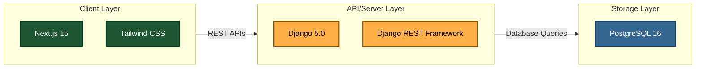
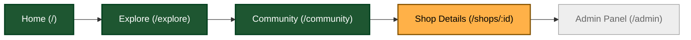
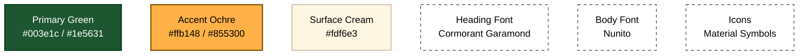
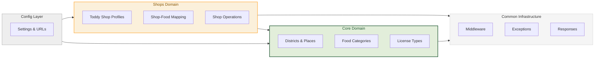
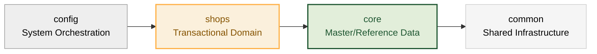

# Toddy Shop Finder

<div align="center">

Discover authentic Kerala toddy shop experiences where tradition meets taste.

[](LICENSE) [](https://github.com/KERALACODERSCAFE/Kerala-toddy-finder) [](https://nextjs.org/) [](https://www.djangoproject.com/) [](https://www.postgresql.org/)

<p align="center">
  <a href="https://github.com/keralacoderscafe/kerala-toddy-finder/graphs/contributors">
    
  </a>
</p>

---

</div>

## Introduction
Toddy Shop Finder is a centralized, community-driven discovery platform for authentic Kerala toddy shops. It helps locals and tourists discover establishments rated by food quality, hygiene standards, and overall experience.

---

## Key Features

*   **Shop Discovery by Location:** Find local shops with map accuracy.
*   **Ratings & Reviews:** Authenticated community reviews to guide visits.
*   **Signature Flavors:** Highlight mouth-watering dishes unique to each shop.
*   **Hygiene Indicators:** Standardized grading for a clean dining experience.
*   **Photo Sharing:** Share photos of the ambiance, food, and experience.
*   **Tourist-Friendly Information:** Curated guides and information for global travelers.
*   **Favorites & Recommendations:** Personalize lists and get custom recommendations.

---

## Tech Stack



---

## Development Setup

### Frontend Setup

```bash
# Navigate to the frontend directory
cd toddy_shop_frontend

# Install dependencies
npm install

# Run the local development server (accessible at http://localhost:3000)
npm run dev
```

### Backend Setup

```bash
# Navigate to the backend directory
cd toddy_shop_backend

# Configure backend environment (migrations and server run)
# python manage.py migrate
# python manage.py runserver
```

---

## Codebase Navigation

The project is split into separate frontend and backend codebases.

### Frontend (Next.js 15 + Tailwind CSS)

```bash
toddy_shop_frontend/
├── src/
│   ├── app/                    # Next.js App Router Pages
│   │   ├── layout.tsx           # Global Shell (Fonts, Navbar, Footer, Mobile Navigation)
│   │   ├── page.tsx             # Landing Page
│   │   ├── explore/             # Map-based Shop Explorer
│   │   ├── community/           # Heritage Hub & Community Feed
│   │   ├── shops/[id]/          # Shop details page
│   │   └── admin/               # Management panel
│   ├── components/              # Modular UI Components
│   │   ├── layout/              # Navbars, footers, mobile panels
│   │   ├── home/                # Hero, signature dishes, district explorer
│   │   └── ui/                  # Reusable components (ShopCard, LeafChip)
│   └── lib/                     # Data Stores & Constants (Shops, Districts, Stories)
├── next.config.ts
├── tailwind.config.ts
└── package.json
```

### Frontend Pages & Navigation



| Route | Page / Section | Description |
| :--- | :--- | :--- |
| `/` | Landing Page | Immersive hero search, featured shops, interactive district explorer, signature flavors gallery, step-by-step how it works, and CTA sections. |
| `/explore` | Map Explorer | Fullscreen interactive map with floating search, custom shop markers, and a side-drawer recommending top picks. |
| `/community` | Heritage Hub | Cultural stories feed, bento-grid dish gallery, top connoisseurs leaderboard, and join CTA. |
| `/shops/[id]` | Shop Details | Profile of a specific shop showing reviews, menu highlights, and location (mocked/ready for API). |
| `/admin` | Admin Panel | Management interface for shop verifications and moderating reviews (mocked/ready for API). |

### Design System

The frontend is styled under the Tactile Minimalism design language:



<table width="100%">
  <thead>
    <tr>
      <th align="left" width="20%">Token</th>
      <th align="left" width="30%">Hex Value</th>
      <th align="left" width="50%">Role</th>
    </tr>
  </thead>
  <tbody>
    <tr>
      <td><b>Primary</b></td>
      <td><code>#003e1c</code> / <code>#1e5631</code></td>
      <td>Deep Forest Green: Used as the dominant brand color across the entire application interface to establish an organic and editorial tone.</td>
    </tr>
    <tr>
      <td><b>Accent</b></td>
      <td><code>#ffb148</code> / <code>#855300</code></td>
      <td>Warm Ochre: Applied selectively for call-to-action buttons, interactive links, highlights, and emphasis elements to guide the user's attention.</td>
    </tr>
    <tr>
      <td><b>Surface</b></td>
      <td><code>#fdf6e3</code></td>
      <td>Earthy Cream: Serves as the primary backdrop color, creating a warm, readable, tactile contrast that feels soft on the eyes.</td>
    </tr>
    <tr>
      <td><b>Heading Font</b></td>
      <td>Cormorant Garamond</td>
      <td>Cormorant Garamond: A sophisticated serif typeface chosen to convey editorial elegance, heritage, and regional tradition in all major headers.</td>
    </tr>
    <tr>
      <td><b>Body Font</b></td>
      <td>Nunito</td>
      <td>Nunito: A modern, friendly rounded sans-serif typeface used for body copy, providing excellent legibility and clean structure.</td>
    </tr>
    <tr>
      <td><b>Icons</b></td>
      <td>Material Symbols Outlined</td>
      <td>Material Symbols Outlined: A clean, customizable outlined icon system ensuring consistent visual weight and modern user interface indicators.</td>
    </tr>
  </tbody>
</table>

---

## Backend Architecture (Django 5.0 + PostgreSQL)

```bash
toddy_shop_backend/
├── config/                      # Django project configuration & entrypoints
├── common/                      # Shared middleware, exception handling, custom response wrappers
├── core/                        # Reference/Master data views, serializers, and migrations
└── shops/                       # Transactional models (ToddyShop, Licenses, Food Mappings)
```

### Architecture & Module Design

We adopt a strict Layered Domain Architecture to isolate master data from business transactions.



### Module Breakdown



| Module | Core Responsibility | Key Components |
| :--- | :--- | :--- |
| **`core`** | Master / Reference Data | Districts, Places, Food & Shop Categories, Facilities, Hygiene Tags, Rating Types, License Types. |
| **`shops`** | Transactional Domain | Toddy Shop management, active License validation, Shop-to-Food mappings, user reviews, and check-ins. |
| **`common`** | Shared Infrastructure | Centralized Exception Handling, request Middleware, Pagination, standard JSON API formatting. |
| **`config`** | System Orchestration | Django settings, base urls, ASGI/WSGI entry-points. |

### Development Rules

*   Business logic must be encapsulated inside `views.py`.
*   Input validation is mandatory for all endpoints.
*   Always use the common response wrapper.
*   Handle all errors using the centralized exception handler.
*   Ensure important transactions and events are properly logged.

---

## Project Vision & Context

### Project Vision
To become the most trusted platform for discovering authentic toddy shop experiences in Kerala.

### Project Objectives
*   **Discover:** Help users locate the best toddy shops.
*   **Standards:** Promote hygiene and food quality standards.
*   **Local Economy:** Support local businesses and culinary artisans.
*   **Tourism:** Enhance cultural tourism by showcasing local culinary heritage.
*   **Insights:** Provide user-driven ratings and reviews.

---

## Contributing

We welcome all contributors. Thank you for helping us preserve Kerala's culture and support local culinary businesses.

```mermaid
graph LR
    A[1. Fork & Clone Repo] --> B[2. Create Feature Branch]
    B --> C[3. Pick/Claim an Issue]
    C --> D[4. Code & Commit]
    D --> E[5. Push to Fork]
    E --> F[6. Open Pull Request]
    F --> G[7. Code Review & Merge]

    style A fill:#1e5631,stroke:#003e1c,stroke-width:2px,color:#fff
    style B fill:#1e5631,stroke:#003e1c,stroke-width:2px,color:#fff
    style C fill:#1e5631,stroke:#003e1c,stroke-width:2px,color:#fff
    style D fill:#1e5631,stroke:#003e1c,stroke-width:2px,color:#fff
    style E fill:#1e5631,stroke:#003e1c,stroke-width:2px,color:#fff
    style F fill:#ffb148,stroke:#855300,stroke-width:2px,color:#000
    style G fill:#ffb148,stroke:#855300,stroke-width:2px,color:#000
```



### Steps to Contribute

| Step | Action | Command / Description |
| :---: | :--- | :--- |
| **1** | **Fork** | Fork the main repository to your GitHub account to create your personal copy. |
| **2** | **Clone** | Clone your fork locally using: `git clone https://github.com/YOUR_USERNAME/Kerala-toddy-finder.git` |
| **3** | **Branch** | Create a new descriptive working branch: `git checkout -b feature/your-feature-name` |
| **4** | **Claim** | Pick an active open issue to work on, or open a new one to discuss your proposed changes. |
| **5** | **Commit** | Write clean code and commit changes using Conventional Commits: `git commit -m "feat: description"` |
| **6** | **Push** | Push your completed branch to your remote GitHub fork: `git push origin feature/your-feature-name` |
| **7** | **PR** | Open a Pull Request targeting the main branch of `KERALACODERSCAFE/Kerala-toddy-finder` for review. |

For detailed developer environment setups, database seeding, and guidelines, refer to [CONTRIBUTING.md](CONTRIBUTING.md).

---

## Future Scope & Vision Beyond Code

### Future Scope
*   **Mobile App Integration:** Dedicated iOS & Android apps for seamless on-the-go discovery.
*   **Advanced Filters:** Filter by specific dishes, live music, or family-friendly setups.
*   **AI Recommendation Engine:** Get suggestions based on taste profiles and dining history.
*   **Eco-Tourism Routes:** Curated culinary tour maps across scenic waterways and backwaters.

### Vision Beyond Code
> This project is about preserving Kerala's rich culinary heritage, supporting local businesses, and delivering authentic experiences to people across the globe.

---

## License

This project is licensed under the MIT License. See the [LICENSE](LICENSE) file for details.

---

## Star History

Track our growth and support the project by leaving a star!

<p align="center">
  <a href="https://www.star-history.com/#KERALACODERSCAFE/Kerala-toddy-finder&Date">
    
  </a>
</p>

---

## Acknowledgements

Thanks to all contributors building this platform together. Let's make discovering Kerala's culture accessible to all.
